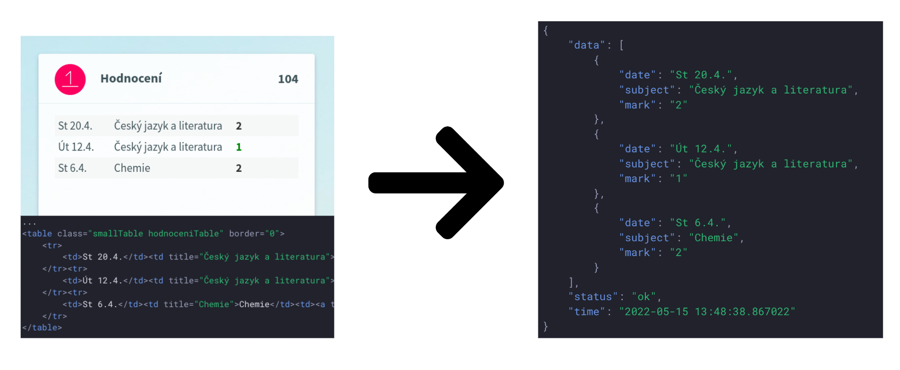
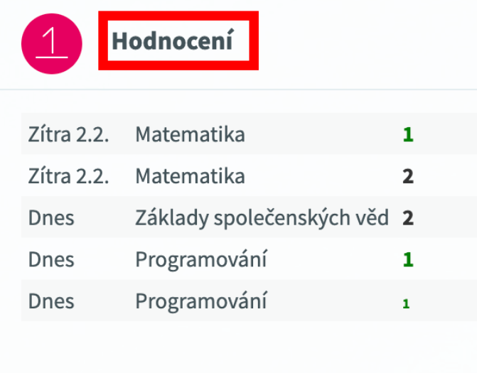
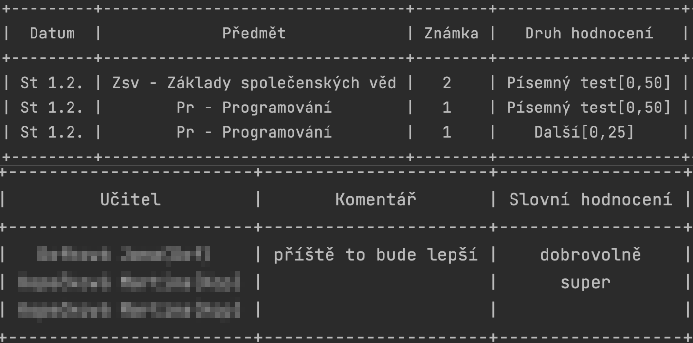

# Škola OnLine stahování známek - web scraping

Nástroj pro automatické stahování známek ze školního systému [Škola OnLine](https://www.skolonline.cz/).
Projekt využívá technologii web scrapingu, která umožňuje získávat data z webů, které nemají API rozhraní.

Nástroj byl vytvářen za účelem výuky a je určen pro vzdělávání.
Projekt byl odprezentován v předmětu Vybrané pertie z informatiky na [Gymnaziu Brno Vídeňská](https://www.gvid.cz/).



## Princip
- script si vytvoří virtuálni session pro uchování cookies a přihlášení
- provede se proces přihlášení do systému pomocí standardního jména a hesla - pomoce POST requestu
- nyní je možné stahovat data z webu
  - stahování probíhá pomocí GET requestu na konkrétní URL adresu
  - skript aktuálně umí stáhnout poslední známku z domovské stránky
  - ve výchozím stavu se zobrazují pouze 3 známky, aby bylo možné stáhnout více známek je nutné v Parametrech aplikace upravit `Počet zobrazených záznamů v přehledu informací žáka/studenta`
  - dále skript umí vyhledat podrobnosti o poslední známce (předmět, datum, hodnocení, ...)
  - výsledky jsou zobrazeny v konzoli - v tabulce


## Instalace

```bash
pip install -r requirements.txt
```

## Úprava parametrů
V souboru `skola-online-znamky.py` je nutné upravit parametry pro přihlášení do systému.

```py
if __name__ == '__main__':
    log_in_sol('username', 'password')
	...
```

## Spuštění

```bash
python skola-online-znamky.py
```

## Výsledek

